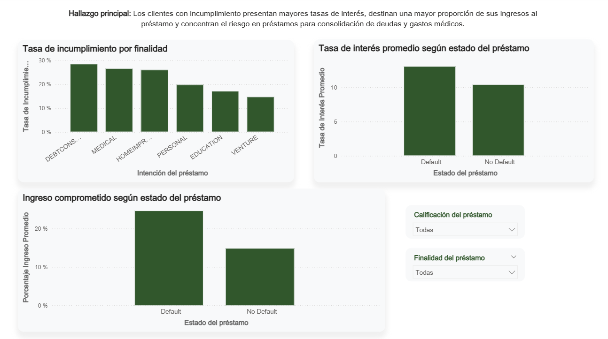

# Análisis de Riesgo Crediticio
Proyecto de análisis de datos enfocado en identificar los principales factores asociados al incumplimiento de préstamos y construir un perfil de los clientes con mayor riesgo crediticio.
El proyecto integra **Python para el análisis exploratorio de datos** y **Power BI para la visualización y comunicación de resultados**, transformando los datos en hallazgos y recomendaciones orientadas a la toma de decisiones.

## Problema de negocio
El incumplimiento de préstamos representa un riesgo financiero para las instituciones crediticias. Por ello, resulta importante identificar las características de los clientes y de los préstamos que presentan una mayor asociación con el incumplimiento.

Este proyecto busca analizar el comportamiento de la cartera e identificar factores de riesgo que permitan comprender qué características presentan los clientes con mayor riesgo crediticio y apoyar una evaluación más informada de futuras solicitudes.

## Objetivos

### Objetivo general

Analizar las características financieras, laborales y crediticias de los clientes para identificar patrones asociados al incumplimiento de préstamos.

### Objetivos específicos

- Analizar la distribución general de préstamos y clientes.
- Evaluar la relación entre la calificación del préstamo y el incumplimiento.
- Identificar las finalidades de préstamo con mayores tasas de incumplimiento.
- Comparar las tasas de interés entre clientes con y sin incumplimiento.
- Analizar el porcentaje del ingreso destinado al préstamo.
- Construir un perfil descriptivo del cliente con mayor riesgo de incumplimiento.
- Comunicar los resultados mediante un dashboard interactivo en Power BI.

## Dataset
El análisis utiliza el archivo `credit_risk_dataset.csv`, que contiene información demográfica, laboral y crediticia de clientes y solicitudes de préstamo.

Entre las principales variables analizadas se encuentran:

- Edad del cliente.
- Ingreso anual.
- Antigüedad laboral.
- Situación de vivienda.
- Finalidad del préstamo.
- Calificación del préstamo.
- Monto solicitado.
- Tasa de interés.
- Estado del préstamo.
- Porcentaje del ingreso destinado al préstamo.
- Historial crediticio.

## Herramientas utilizadas

| Herramienta | Uso en el proyecto |
|---|---|
| **Python** | Limpieza, exploración y análisis de datos |
| **Pandas** | Manipulación y preparación del dataset |
| **Matplotlib / Seaborn** | Visualización durante el análisis exploratorio |
| **Jupyter Notebook** | Desarrollo y documentación del análisis |
| **Power BI** | Creación del dashboard interactivo |
| **DAX** | Construcción de medidas y KPIs |
| **Canva** | Diseño de la presentación ejecutiva e infografía |
| **GitHub** | Documentación y publicación del proyecto |

## Proceso de análisis

El proyecto se desarrolló en las siguientes etapas:

1. **Comprensión del problema de negocio**
   - Definición de las preguntas principales del análisis.

2. **Preparación y limpieza de datos**
   - Revisión de valores nulos y duplicados.
   - Validación de tipos de datos.
   - Revisión de valores atípicos y consistencia de variables.

3. **Análisis exploratorio con Python**
   - Distribución del estado de los préstamos.
   - Riesgo por calificación crediticia.
   - Distribución y riesgo según finalidad.
   - Comparación de tasas de interés.
   - Análisis del porcentaje del ingreso comprometido.

4. **Construcción del perfil de riesgo**
   - Comparación de características entre clientes con y sin incumplimiento.
   - Identificación de variables asociadas a un mayor riesgo.

5. **Visualización en Power BI**
   - Creación de KPIs.
   - Desarrollo de visualizaciones interactivas.
   - Incorporación de filtros por calificación y finalidad del préstamo.

6. **Comunicación de resultados**
   - Elaboración de una presentación ejecutiva.
   - Desarrollo de una infografía resumen.
   - Formulación de recomendaciones orientadas al negocio.
## Principales hallazgos

- La tasa general de incumplimiento de la cartera es aproximadamente **22 %**.
- Las calificaciones **D, E, F y G** presentan una mayor concentración de riesgo de incumplimiento.
- Los clientes con incumplimiento presentan una tasa de interés promedio cercana al **13 %**, frente a aproximadamente **10.4 %** entre quienes no incumplen.
- Los clientes con incumplimiento destinan aproximadamente **25 % de sus ingresos al préstamo**, frente a cerca del **15 %** entre quienes no incumplen.
- Los préstamos destinados a **consolidación de deudas** y **gastos médicos** presentan las mayores tasas de incumplimiento.
- La edad promedio es muy similar entre ambos grupos, por lo que no aparece como uno de los principales elementos diferenciadores dentro de este análisis.

## Perfil del cliente con mayor riesgo de incumplimiento

A partir del análisis descriptivo, el grupo de clientes con incumplimiento presenta, en promedio:

| Característica | Perfil identificado |
|---|---:|
| Edad | ≈ 27 años |
| Ingreso anual | ≈ $49K |
| Antigüedad laboral | ≈ 4 años |
| Monto del préstamo | ≈ $10.8K |
| Tasa de interés | ≈ 13 % |
| Ingreso comprometido | ≈ 25 % |
| Finalidades de mayor riesgo | Consolidación de deudas y gastos médicos |
| Calificaciones de mayor riesgo | D, E, F y G |

## Recomendaciones

A partir de los resultados obtenidos se recomienda:

- Priorizar la evaluación de la **capacidad de pago** del solicitante.
- Considerar el **porcentaje del ingreso comprometido** como una variable relevante durante la evaluación crediticia.
- Evaluar conjuntamente **ingresos, estabilidad laboral, monto solicitado y obligaciones financieras**.
- Realizar un seguimiento más detallado de solicitudes destinadas a **consolidación de deudas y gastos médicos**.
- Evitar utilizar la edad como criterio aislado de evaluación, ya que en este análisis no presenta diferencias relevantes entre clientes con y sin incumplimiento.

## Resumen visual del análisis

La siguiente infografía presenta una síntesis de los principales indicadores, factores de riesgo, perfil identificado y recomendaciones obtenidas a partir del análisis.

## Dashboard en Power BI

Se desarrolló un dashboard interactivo en Power BI para facilitar la exploración de la cartera y de los principales factores asociados al incumplimiento.

El dashboard está compuesto por tres páginas:

1. **Resumen ejecutivo:** principales KPIs, estado de los préstamos, riesgo por calificación y distribución por finalidad.
2. **Factores de riesgo:** análisis de incumplimiento por finalidad, tasa de interés e ingreso comprometido.
3. **Perfil de riesgo:** síntesis de las características del grupo de clientes con mayor riesgo de incumplimiento y recomendación estratégica.

### 1. Resumen ejecutivo

### 2. Factores de riesgo

### 3. Perfil del cliente con mayor riesgo

## Archivos del proyecto

Puedes consultar directamente los principales entregables del proyecto:

- [**Notebook de Python**](Notebooks/credit_risk_analysis_final.ipynb) — Análisis exploratorio, visualizaciones y construcción del perfil de riesgo.

- [**Dashboard de Power BI**](Dashboard/Credit_Risk_Dashboard.pbix) — Dashboard interactivo con KPIs, factores de riesgo y perfil del cliente.

- [**Presentación ejecutiva**](Presentación/Análisis%20Exploratorio%20de%20Riesgo%20Crediticio.pdf) — Síntesis de hallazgos, insights y recomendaciones.

- [**Dataset**](Data/credit_risk_dataset.csv) — Conjunto de datos utilizado durante el análisis.

## Estructura del repositorio

- **Data**  
Dataset utilizado para el análisis.
- **Notebooks**  
Notebook de Python con la limpieza, análisis exploratorio y construcción del perfil de riesgo.
- **Dashboard**  
Archivo `.pbix` con el dashboard interactivo desarrollado en Power BI.
- **Presentación**  
Presentación ejecutiva con los principales hallazgos, insights y recomendaciones.
- **Imágenes**  
Infografía y capturas de las páginas del dashboard.

## 👩‍💻 Autora

**Thelma**

Proyecto desarrollado como parte de mi portafolio de **Data Analytics**, enfocado en el análisis, visualización y comunicación de información para apoyar la toma de decisiones.
